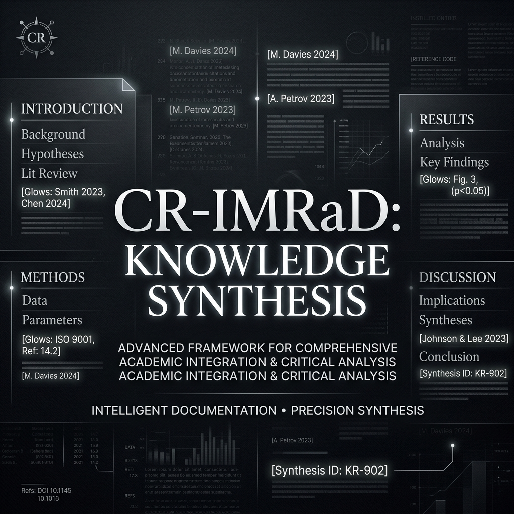

  
  
  <h1>CR-IMRaD</h1>
  
<b>Personal Development Mirror</b>

  

    
    
  

---

### ⚠️ Mirror Notice
This is the personal development branch for **CR-IMRaD**. It contains drafting for new versions of the documentation standard and experimental validator configurations.

**[➡️ Go to Official Repository](https://github.com/DodecaGoneSystems/CR-IMRAD)**

---

### 📄 About the Standard
**CR-IMRaD** converts dense technical knowledge into accessible, high-fidelity research documents. It forces the author to prioritize immediate somatic anchoring before introducing complex mathematical or physical concepts.

### 🌱 Ecosystem
- **Official Hub:** [DodecaGone Systems](https://github.com/DodecaGoneSystems)
- **Physics Engne:** [Forge Math](https://github.com/DodecaGoneSystems/ForgeMath)

  <code>><^</code> 
  <i>GNU Terry Pratchett</i>

